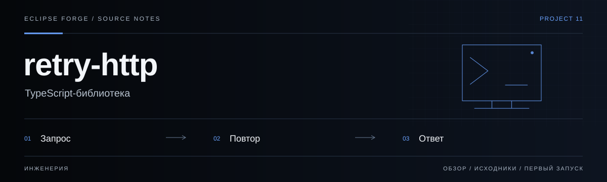

# retry-http



**TypeScript-библиотека.** Небольшая библиотека HTTP-повторов с backoff для устойчивых сетевых клиентов.

<!-- repository-guide:start -->
[Первый запуск](#readme-start) · [Что внутри](#readme-map) · [Путеводитель](docs/repository-guide.md#start) · [Карта кода](docs/repository-guide.md#map) · [Проверки](docs/repository-guide.md#checks) · [Границы и права](docs/repository-guide.md#boundaries)

<a id="readme-map"></a>

## Проект за минуту

- **[Retry API](<src/retry.ts>)** — Backoff, jitter, отмена и условия повторного запроса.
- **[Поведение под тестом](<src/retry.test.ts>)** — Проверки повторов, задержек и обработки ошибок.
- **[Пакет](<package.json>)** — ESM export, декларации типов и команды сборки.

<a id="readme-start"></a>

## Начать локально

**Среда:** Node.js и npm. **Источник:** [package.json](<package.json>).

Из корня клонированного репозитория:

```bash
npm ci
npm run test
```

Это библиотека: dev-сервера нет. После установки тесты запускаются локально; сборка пакета — `npm run build`.

<details>
<summary><strong>Перед первым запуском и изменением кода</strong></summary>

- Команды сверены с исходниками 8 сентября 2026. Это инструкция, а не отметка об успешном запуске или текущем production.
- Установка зависимостей может обращаться в registry и выполнять lifecycle scripts. Используйте отдельную рабочую среду и демонстрационные данные.
- Повтор изменяющего запроса требует идемпотентности; retry не заменяет timeout, отмену и ограничения нагрузки.


</details>
<!-- repository-guide:end -->

## Features

- Configurable max attempts, initial delay, max delay, and backoff factor
- Jitter (±50%) to prevent thundering-herd on shared rate limits
- `shouldRetry` predicate for conditional retry (e.g., only on 429/5xx)
- `onRetry` callback for telemetry / logging hooks
- `AbortSignal` support for cancellation
- `RetryError` class preserving attempt count and last error
- `isRetryableHttpStatus` helper (408, 425, 429, 500–599)
- Tree-shakable ESM, ships with type declarations

## Install

```bash
npm install @pavelhopson/retry-http
```

## Usage

```typescript
import { retry, isRetryableHttpStatus, RetryError } from '@pavelhopson/retry-http';

// Basic usage — retry a fetch call up to 3 times
const response = await retry(
  async () => {
    const res = await fetch('https://api.example.com/data');
    if (!res.ok && isRetryableHttpStatus(res.status)) {
      throw new Error(`HTTP ${res.status}`);
    }
    return res;
  },
  { maxAttempts: 3, initialDelayMs: 500, jitter: true },
);

// With shouldRetry predicate — only retry network errors
const data = await retry(
  async () => {
    const res = await fetch('https://api.example.com/data');
    if (!res.ok) throw new Error(`HTTP ${res.status}`);
    return res.json();
  },
  {
    maxAttempts: 3,
    shouldRetry: (error) => error instanceof TypeError, // network errors only
    onRetry: (error, attempt, delayMs) => {
      console.warn(`Retry ${attempt} in ${delayMs}ms:`, error);
    },
  },
);

// With AbortSignal
const controller = new AbortController();
setTimeout(() => controller.abort(), 10_000); // 10s global timeout

try {
  await retry(fetchData, { signal: controller.signal });
} catch (e) {
  if (e instanceof RetryError) {
    console.error(`Failed after ${e.attempts} attempts:`, e.lastError);
  }
}
```

## API

### `retry<T>(fn, options?): Promise<T>`

| Option | Type | Default | Description |
|---|---|---|---|
| `maxAttempts` | `number` | `3` | Total attempts (including first) |
| `initialDelayMs` | `number` | `300` | Delay before first retry |
| `maxDelayMs` | `number` | `10000` | Cap on computed delay |
| `backoffFactor` | `number` | `2` | Multiplier per attempt |
| `jitter` | `boolean` | `true` | Add ±50% randomness |
| `shouldRetry` | `(error, attempt) => boolean` | `() => true` | Return false to stop early |
| `onRetry` | `(error, attempt, delayMs) => void` | — | Hook for logging |
| `signal` | `AbortSignal` | — | Cancel retries |

### `isRetryableHttpStatus(status: number): boolean`

Returns `true` for HTTP 408, 425, 429, and 500–599.

### `RetryError`

Thrown when all attempts are exhausted. Properties:
- `.attempts: number` — how many attempts were made
- `.lastError: unknown` — the error from the final attempt

### `computeDelay(attempt, initialDelayMs, backoffFactor, maxDelayMs, jitter): number`

Exported for testing — computes the delay for a given attempt.

## Provenance

Модуль выделен из разработки [Eclipse Valhalla](https://github.com/PavelHopson/Eclipse-Valhalla). Связанные реализации есть в [CryptoPulse](https://github.com/PavelHopson/CryptoPulse) и [Eclipse AI Hub](https://github.com/PavelHopson/eclipse-ai-hub). Это история происхождения, а не доказательство побайтового совпадения текущих версий. Актуальное поведение пакета проверяется его собственными тестами в [src/retry.test.ts](src/retry.test.ts).

## License

MIT
